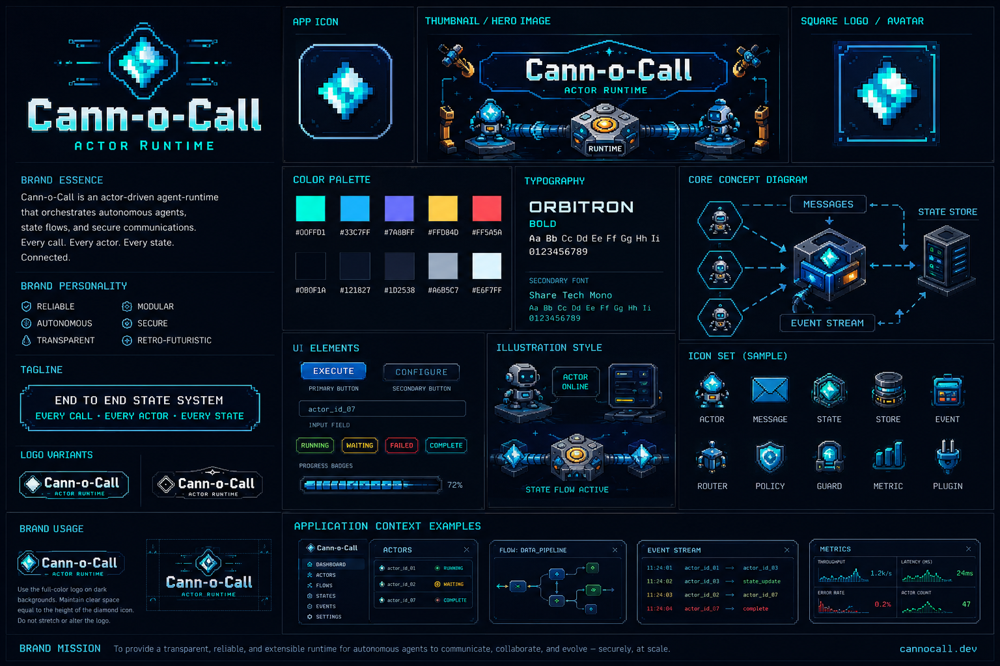
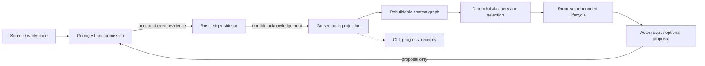

# Cann-o-Call

<p align="center">
  
</p>

> **Every call. Every actor. Every state. Connected.**

**ACTOR RUNTIME**

Cann-o-Call is a source-available, actor-driven runtime for bounded ingestion,
deterministic context-graph queries, and explicit state-transition evidence. It
keeps admission, durable evidence, local actor lifecycle, and operator views in
separate roles rather than treating a query result or an actor as authority.

**RC.4 status:** `0.1.0-rc.4` is the intended next immutable release
candidate. Until `v0.1.0-rc.4` is created, `v0.1.0-rc.3` is the latest
published tag. An immutable tag, not `main`, identifies a reproducible release.

## Architecture and authority



| Layer | Authority and boundary |
| --- | --- |
| **Go** | Admission and semantic state-transition authority: validates proposals, policy, stale/duplicate conditions, activation, and capability admission; advances its projection only after the durable acknowledgement. |
| **Rust sidecar** | Durable accepted-event/evidence authority: appends and verifies the hash-chained accepted history and checkpoints. It does not make policy or admission decisions. |
| **Proto.Actor** | Local, bounded lifecycle runtime only: mailbox, supervision, TTL/passivation, depth, budget, and active-count limits. It is **not** canonical state authority. |
| **Context graph** | Deterministic, rebuildable operational/source projection; never competing canonical persistence. |
| **Capabilities, receipts, progress, and CLI** | Bounded execution or operator/observability projections. They are **non-authority**: a successful execution, receipt, or display cannot accept a canonical mutation. |

Accepted mutations follow one direction: proposal → Go validation → Rust durable
append and acknowledgement → Go projection advance → controlled effect where
applicable → receipt. If Rust is absent or rejects the append, semantic
admission fails closed; the local Go JSONL is only a Rust-acknowledged mirror.

## RC.4 release-candidate functionality

- Go HTTP server, operator CLI, and a Rust/Axum ledger sidecar.
- Bounded source ingestion with safe path handling, ZIP/envelope compatibility,
  SHA-256 identities, content/metadata separation, and an 8 MiB per-source
  ingest limit.
- Deterministic source/context graphs and deterministic baseline query scoring:
  bounded candidate selection and bounded context packets.
- Local Proto.Actor materialization with default limits of 16 active actors,
  depth 8, activation budget 32, and five-minute TTL; actor confidence is
  telemetry only.
- Hash-chained Rust accepted-event evidence, strict ledger startup validation,
  verification, and checkpoints.
- Progress/task views, receipts, replay/snapshot verification, and a shared
  Studio ViewModel. **Flatten Workspace Studio** is terminal-first through the
  Go TUI; `/ui` is its secondary HTMX projection, not a competing status model.
- A bounded reference/native membrane with pre-allowlisted Go operations. It
  has no canonical-state authority.

### Explicit limitations

- This is pre-1.0 release-candidate software; no production-readiness or
  publication authorization is implied by this README.
- Actor descriptors, graph stores, orchestrators, and in-flight tasks are
  in-memory/rebuildable and are not resurrected as live actors after restart.
- There is no actor remoting, clustering, distributed graph, LLM embedding, or
  vector-database runtime in this RC.
- PDF, DOCX, and OCR ingestion adapters, plus streaming ingestion beyond the
  bounded source path, are not implemented.
- The capability package is bounded and static; there is no dynamic plugin
  discovery or HTTP/CLI capability-execution endpoint.
- **Unrestricted PureGo/dlopen is NOT_IMPLEMENTED.** There is no arbitrary
  library loading, arbitrary symbol execution, dynamic plugin loader, or
  arbitrary shell execution. The native membrane only dispatches its explicit
  allowlist.
- Capability and scoring panels may show **unavailable** when their collector
  is unattached. This is an intentional bounded runtime state, not fabricated
  capability or scoring data; attached collector projections remain observable.

## Quick start

### Supported environment and tooling

RC.4 is tested on Linux/amd64 with a POSIX-compatible shell. Build and runtime
instructions require the Go toolchain specified by `go.mod` (currently Go
`1.25.3`), Rust/Cargo for `sidecar/Cargo.toml`, `make`, and the standard Unix
utilities used by the Makefile (`cp` and `ln`). Other operating systems and
toolchains are not claimed as supported by this release candidate.

### Release checkout

Cloning `main` obtains ongoing development, not an immutable release. Check
out a published tag for reproducible evaluation:

```bash
git clone https://github.com/es-3581100/Cann-o-Call.git
cd Cann-o-Call

# Current published release candidate at the time RC.4 is prepared.
git checkout v0.1.0-rc.3

# After RC.4 is published, use its immutable tag instead.
# git checkout v0.1.0-rc.4
```

Build the checked-out source distribution:

```bash

# Build the Go runtime/CLI and the Rust durable sidecar.
make build
cargo build --locked --manifest-path sidecar/Cargo.toml

# Verify the source-defined CLI and focused tests.
./bin/cann-o-call --help
go test ./...
cargo test --locked --manifest-path sidecar/Cargo.toml
```

`make test` and `make run` are also provided. `make build` creates
`bin/flatten-workspace` and an alias at `bin/cann-o-call`.

## Boot walkthrough

Run the two services in separate terminals. These commands intentionally bind
to loopback and keep runtime state under the clone; substitute isolated paths
when operating outside a disposable checkout.

```bash
# Terminal 1 — durable accepted-event/evidence recorder
SIDECAR_DATA_DIR="$PWD/.local/sidecar" \
SIDECAR_LISTEN_ADDR=127.0.0.1:9090 \
cargo run --locked --manifest-path sidecar/Cargo.toml
```

```bash
# Terminal 2 — Go admission, query, and local actor runtime
DATA_DIR="$PWD/.local/cann-o-call" \
RUST_LEDGER_URL=http://127.0.0.1:9090 \
ADDR=127.0.0.1:8080 \
go run .
```

```bash
# Terminal 3 — health, ingest, query, and operator status
curl -fsS http://127.0.0.1:8080/api/health
go run . status --json
go run . ledger verify --json

mkdir -p /tmp/cann-o-call-demo
printf 'hello from Cann-o-Call actor runtime\n' > /tmp/cann-o-call-demo/hello.txt
go run . ingest /tmp/cann-o-call-demo/hello.txt --workspace rc4-demo --json
go run . query hello --workspace rc4-demo --json
curl -fsS http://127.0.0.1:8080/api/ledger/verify
```

The first command creates a source packet, asks Go to admit it, requires the
Rust acknowledgement, then applies it to the rebuildable graph. The matching
query scores the file node deterministically, applies bounded selection,
materializes an eligible local actor, and returns its non-authoritative
`ActorResult`.
An actor-originated mutation would remain only a proposal until Go admits it and
Rust acknowledges the accepted event.

Use `Ctrl-C` in Terminal 2 and Terminal 1 to stop the Go runtime and Rust
sidecar. The walkthrough keeps its state under `.local/` in the clone; remove
that directory and `/tmp/cann-o-call-demo` when finished.

### Runtime configuration

| Variable | Default / role |
| --- | --- |
| `ADDR` | `:8080`; Go server listen address and CLI base address. |
| `DATA_DIR` | `data`; Go event mirror, receipts, progress, quarantine, and related local state. |
| `RUST_LEDGER_URL` | Unset; Rust sidecar base URL. Required for semantic accepted transitions. |
| `SIDECAR_DATA_DIR` | `data-sidecar`; Rust ledger and checkpoints. |
| `SIDECAR_LISTEN_ADDR` | `0.0.0.0:9090`; Rust sidecar listen address. |
| `ACTOR_MAX_COUNT`, `ACTOR_MAX_DEPTH`, `ACTOR_MAX_BUDGET`, `ACTOR_TTL` | Actor bounds; defaults `16`, `8`, `32`, and `5m`. |
| `AUTHORITY_TOKEN` | Token used by guarded workspace/checkpoint operations through `X-Authority-Token` or form input. |
| `ALLOW_ABSOLUTE_ROOT` | Only `true` permits absolute materialization roots. |

### Studio surfaces

The primary operator surface is the terminal Studio. It requests only the
read-only `GET /api/studio` ViewModel; it does not create authority, invoke a
shell, or fabricate offline telemetry.

```text
./bin/flatten-workspace studio --once
./bin/flatten-workspace studio
```

Interactive commands are `monitor`, `ranger`, `refresh`, `select <index>`,
`help`, and `quit` (the same commands may be prefixed with `:`). `--once`
prints a plain-text full Monitor and three-column Ranger snapshot for scripts.
The server-rendered `/ui` page is a secondary HTMX projection of that same
ViewModel; safe existing workspace/tree/file drilldown routes remain available.
With the documented loopback server running, open
`http://127.0.0.1:8080/ui` in a browser. The corresponding read-only API is
`http://127.0.0.1:8080/api/studio`.

## HTTP and CLI surface

The server registers, among others, these operator-facing routes:

| Method | Endpoint | Purpose |
| --- | --- | --- |
| `GET` | `/api/health` | Health response. |
| `GET` | `/api/status` | Aggregated ledger, graph, actor, context, and workspace status. |
| `GET` | `/api/studio` | Shared read-only Studio ViewModel for terminal and browser. |
| `POST` | `/api/ingest` | Ingest source bytes/envelope or multipart upload into the ingest/graph path. |
| `POST` | `/api/query` | Deterministic query, selection, context-packet, and actor-result path. |
| `GET` | `/api/ledger/status`, `/api/ledger/verify` | Ledger status and local/sidecar verification. |
| `GET` | `/api/tasks`, `/api/tasks/{id}` | Bounded task progress views. |
| `GET` | `/api/workspaces/{id}/actors` | Actor descriptors for an imported workspace. |
| `GET` | `/api/workspaces/{id}/replay/verify` | Replay verification for an imported workspace. |

CLI commands are served by `go run . <command>` or the built binary:

```text
status
ingest <path> [--workspace <id>]
query <query-string> [--workspace <id>]
actor list [--workspace <id>]
actor inspect <id>
ledger status | verify
replay verify [--workspace <id>]
snapshot <workspaceID>
task status <id> | task list
studio [--once]
```

Use `--json` (or `-j`) with any CLI command. The CLI can report offline
observations when the Go server is unavailable; offline output is not proof of
durable admission.

## Repository map

```text
main.go                    Go CLI/server entrypoint
internal/transition/       Go transition admission and semantic projection
internal/eventlog/         Rust-acknowledged Go event mirror and verification
internal/ingest/           Source packets, adapters, normalization, identities
internal/graph/            Deterministic rebuildable context graph
internal/orchestrator/     Ingest/query/selection/actor coordination
internal/actorstub/        Local bounded Proto.Actor lifecycle runtime
internal/capability/       Static bounded capability framework and membrane
internal/server/           HTTP, UI, workspace, task, and verification handlers
sidecar/                   Rust/Axum durable accepted-event ledger
web/                       Embedded server-rendered UI assets
assets/brand/              Canonical repository brand source image
scripts/release/           RC reproducibility, packaging, and artifact checks
```

## Release, license, and contributions

Cann-o-Call `0.1.0-rc.4` is source-available under the **Business Source
License 1.1**, not an OSI open-source license before its Change Date. The
binding terms are in [LICENSE](LICENSE). For this source distribution, the
Change Date is **2030-09-01** and the Change License is **Apache License 2.0**.

The Additional Use Grant permits qualifying internal production use for
organizations with fewer than 50 aggregate FTE and less than US $5,000,000
aggregate annual revenue, including Affiliates. Hosted third-party SaaS,
managed services, resale, white-label, and related commercial-service uses
require a separate commercial license. This summary is non-binding; read
[LICENSE](LICENSE) and [LICENSING.md](LICENSING.md).

External code contributions and pull requests are not currently accepted while
contributor licensing and relicensing policy is finalized. Bug reports, feature
requests, discussions, and documentation suggestions are welcome; see
[CONTRIBUTING.md](CONTRIBUTING.md).

## Documentation

- [Reconciled RC architecture](docs/release/ARCHITECTURE_RECONCILED.md)
- [RC.4 release notes](docs/release/RELEASE_NOTES_v0.1.0-rc.4.md)
- [Historical RC.2 release notes](docs/release/RELEASE_NOTES_v0.1.0-rc.2.md)
- [Release documentation reconciliation](docs/release/DOCS_RECONCILIATION.md)
- [Actor compatibility map](docs/CHUNK-04-actor-compatibility-map.md)
- [Ingest compatibility map](docs/CHUNK-05-ingest-compatibility-map.md)
- [Capability and native membrane map](docs/CHUNK-06-capability-compatibility-map.md)
- [Observability and CLI map](docs/CHUNK-08-observability-map.md)
- [Brand release guide](docs/branding/BRAND_RELEASE_GUIDE.md)
- [Release artifact guidance](docs/release/ARTIFACTS.md)
